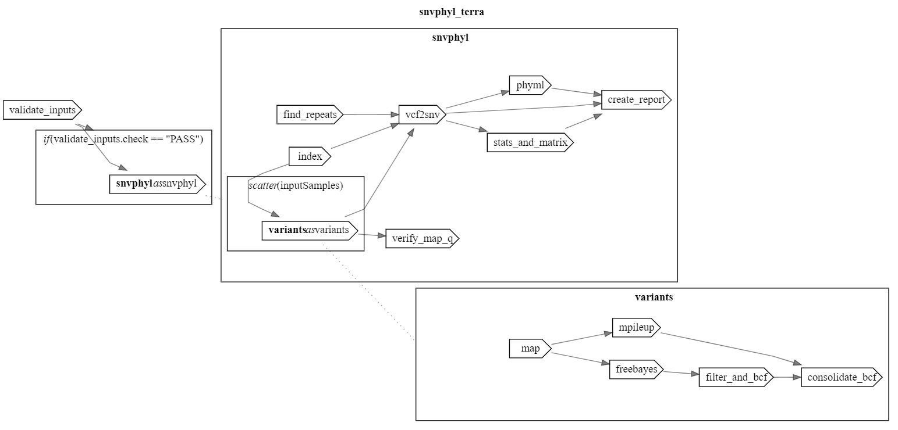

# SNVPhyl_Terra

This is a WDL translation of [SNVPhyl_Nextflow](https://github.com/DHQP/SNVPhyl_Nextflow) based on [SNVPhyl](https://github.com/phac-nml/snvphyl-galaxy/blob/development/docs/workflows/SNVPhyl/1.0.1/snvphyl-workflow-1.0.1.ga) pipeline. The workflow is optimized for [Terra](https://terra.bio/) with a few changes:

1. You can enter a full taxon name (e.g., "Escherichia coli") or an NCBI accession number (e.g., "GCF_000005845.2") instead of giving a fasta file for the reference genome. The workflow will download the reference genome automatically. The pipeline hierarchically selects one of them:
```fasta file > accession number > taxon name```. Although the taxon name is required, it will be ignored when you give an accession number or a reference fasta file. 

2. Some key parameters (min_coverage, min_mean_mapping, snv_abundance_ratio) are exposed as variables like in the original SNVPhyl pipeline.

3. This pipeline creates an HTML summary report besides the standard outputs of SNVPhyl. The report contains a heatmap-styled SNV matrix and a phylogenetic tree. 
<br>[Example report](https://htmlpreview.github.io/?https://github.com/Kincekara/SNVPhyl_Terra/blob/main/files/snvphyl_report.html)

The original SNVPhyl pipeline was written by Aaron Petkau. You can find more information in SNVPhyl [paper](https://www.ncbi.nlm.nih.gov/pmc/articles/PMC5628696/) and [documentation](https://snvphyl.readthedocs.io/en/latest/). Please keep in mind that this is an indirect adaptation of SNVPhyl from Jill Hagey's SNVPhyl_Nextflow pipeline.



## Terra
### Installation
You can install SNVPhyl_Terra from [Dockstore](https://dockstore.org/workflows/github.com/Kincekara/SNVPhyl_Terra/SNVPhyl:main?tab=info) as usual.

### Running workflow
SNVPhyl_Terra requires a **sample set** to run!

Parameters: 

| Variable | Attribute | Description | Required? |
| --- | --- | --- | --- |
| read1 | this.*{sampleset name}s*.*{read1*} | | required |  
| read2 | this.*{sampleset name}s*.*{read2*} | | required |
| samplename | this.*{sampleset name}s*.*{id}* | | required |
| taxon | *"{string}"* | reference taxon | required |
| accession | *"{string}"* | reference accession number | optional |
| reference | *{file}* | reference.fasta | optional |
| window_size | *{integer} (default: 11)* | window size for identifying high-density SNV regions| optional |
| density_threshold | *{integer} (default: 2 )* | SNV threshold for identifying high-density SNV regions | optional |
| min_coverage | *{integer} (default: 10)* | minimum coverage for any given position to be included in the analysis| optional |
| min_mean_mapping | *{integer} (default: 30)* | minimum mean mapping quality score for all reads in a pileup | optional |
| snv_abundance_ratio | *{float} (default: 0.75)* | proportion of reads required to support a variant to be included in the analysis| optional |
| colorscale | *{string} (default: YlGnBu_r)*| background gradient color for SNV matrix. See [colormap](https://matplotlib.org/stable/gallery/color/colormap_reference.html) | optional |
| tree_width | *{integer} (default: 800)* | phylogenetic tree width | optional |

## Local Run
If you want to use the workflow on your local computer, you can use **wf_snvphyl_local.wdl**, which is prepared for that purpose. You will need a workflow manager (miniwdl or cromwell) and a container runtime (docker, singularity, etc.) in your path.

Install workflow from GitHub:

```git clone https://github.com/Kincekara/SNVPhyl_Terra.git```

Prepare inputs:

Create a tab-separated text file (e.g., samples.tsv) including your sample ids and file paths like the below:
```
sample1 /path_to_sample1_read1.fastq.gz /path_to_sample1_read2.fastq.gz
sample2 /path_to_sample2_read1.fastq.gz /path_to_sample2_read2.fastq.gz
...
```

Create a JSON file for inputs (e.g., inputs.json)
```
{
    "snvphyl.reference": "/path/to/reference.fasta",
    "snvphyl.inputSamplesFile": "/path/to/samples.tsv"
}
```
Run the workflow by using **wf_snvphyl_local.wdl**
```
miniwdl run ~/SNVPhlyl_Terra/workflows/wf_snvphyl_local.wdl -i inputs.json
```
## References
Petkau, A., Mabon, P., Sieffert, C., Knox, N. C., Cabral, J., Iskander, M., Iskander, M., Weedmark, K., Zaheer, R., Katz, L. S., Nadon, C., Reimer, A., Taboada, E., Beiko, R. G., Hsiao, W., Brinkman, F., Graham, M., & Gary Van Domselaar. (2017). SNVPhyl: a single nucleotide variant phylogenomics pipeline for microbial genomic epidemiology. *Microbial Genomics*, 3(6). https://doi.org/10.1099/mgen.0.000116

*DHQP/SNVPhyl_Nextflow: Nextflow version of SNVPhyl.* (2022, April 21). GitHub. https://github.com/DHQP/SNVPhyl_Nextflow

‌

‌